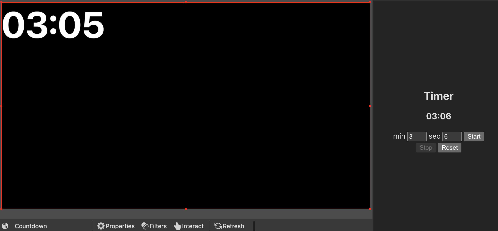

<h1 align=center>
  Countdown-obs-plugin
</h1>

  <i>
    Countdown timer OBS plugin built on HTML, CSS, and Vanilla Javascript.
  </i>

How to start:

- Code > Download ZIP
- Open Controller.html & Display.html in Chrome Browser
- Add Controller url (in Chrome Browser) to OBS Docks > Custom Browser Docks > URL
- Add Display url (in Chrome Browser) to OBS add Sources > Browser > URL
